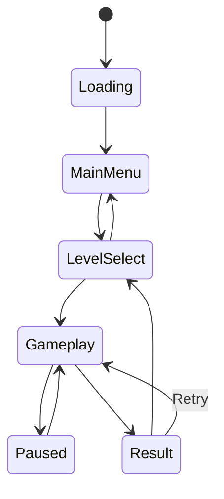
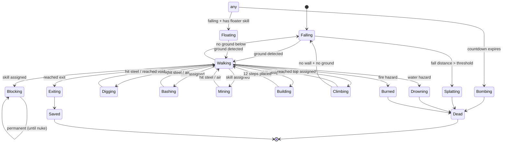

# WebLemmings — Complete Development Plan

## 1. TECHNICAL STACK DECISION

### Recommended Stack

| Layer | Choice | Justification |
|-------|--------|---------------|
| **Language** | TypeScript (strict mode) | Type safety catches bugs early in a stateful game; great IDE support; zero runtime cost |
| **Framework** | None (vanilla) | Lemmings is a single-screen game — no routing, no DOM diffing. A framework adds weight with no benefit |
| **Rendering** | Canvas 2D API | Pixel-perfect terrain destruction requires direct pixel manipulation (`getImageData`/`putImageData`). WebGL is overkill and makes pixel ops harder |
| **Physics** | Custom (no engine) | Lemmings physics is simple: gravity + terrain collision on a pixel grid. A physics engine (Matter.js, etc.) adds complexity for features we won't use |
| **Audio** | Howler.js | Lightweight, handles sprite sheets of SFX, cross-browser Web Audio API abstraction |
| **Build** | Vite | Near-instant HMR, native TS support, tree-shaking, simple config |
| **Testing** | Vitest + Playwright | Vitest for unit/integration (shares Vite config); Playwright for visual/E2E |
| **Linting** | ESLint + Prettier | Standard quality gates |
| **Package Mgr** | pnpm | Fast, strict, disk-efficient |

### Folder Architecture

```
WebLemmings/
├── index.html
├── vite.config.ts
├── tsconfig.json
├── package.json
├── public/
│   ├── assets/
│   │   ├── sprites/         # Sprite sheets (PNG)
│   │   ├── levels/          # Level JSON files
│   │   ├── tilesets/        # Terrain tile images
│   │   └── audio/           # SFX + music (OGG/MP3)
│   └── favicon.ico
├── src/
│   ├── main.ts              # Entry point, boot sequence
│   ├── engine/
│   │   ├── GameLoop.ts      # Fixed-timestep game loop
│   │   ├── SceneManager.ts  # State machine for scenes
│   │   ├── InputManager.ts  # Mouse/touch/keyboard abstraction
│   │   └── AssetLoader.ts   # Preload images, audio, level data
│   ├── scenes/
│   │   ├── MenuScene.ts
│   │   ├── LevelSelectScene.ts
│   │   ├── GameScene.ts
│   │   ├── PauseOverlay.ts
│   │   └── ResultScene.ts
│   ├── game/
│   │   ├── Lemming.ts       # Lemming entity + state machine
│   │   ├── LemmingManager.ts# Spawning, update loop, skill assignment
│   │   ├── Terrain.ts       # Pixel-based destructible terrain
│   │   ├── Hazard.ts        # Traps, water, fire
│   │   ├── Exit.ts          # Level exit trigger
│   │   ├── Spawner.ts       # Trapdoor / spawn point
│   │   └── Skills.ts        # Skill definitions and behaviors
│   ├── rendering/
│   │   ├── Renderer.ts      # Multi-layer canvas compositor
│   │   ├── Camera.ts        # Viewport / scrolling
│   │   ├── SpriteSheet.ts   # Animation frame management
│   │   └── HUD.ts           # Skill bar, counters, timer
│   ├── audio/
│   │   └── AudioManager.ts  # Music + SFX via Howler
│   ├── data/
│   │   ├── LevelSchema.ts   # TypeScript types for level JSON
│   │   └── SkillConfig.ts   # Skill metadata (icon, cost, limits)
│   ├── utils/
│   │   ├── math.ts          # Clamp, lerp, vector ops
│   │   ├── collision.ts     # Pixel collision helpers
│   │   └── storage.ts       # localStorage wrapper
│   └── types/
│       └── index.ts          # Shared enums, interfaces
├── tests/
│   ├── unit/
│   │   ├── Lemming.test.ts
│   │   ├── Terrain.test.ts
│   │   └── Skills.test.ts
│   ├── integration/
│   │   └── LevelCompletion.test.ts
│   └── e2e/
│       └── gameplay.spec.ts
└── tools/
    └── level-editor/         # Phase 3
```

---

## 2. GAME ENGINE ARCHITECTURE

### 2.1 Game Loop — Fixed Timestep with Interpolation

```typescript
// GameLoop.ts — skeleton
const TICK_RATE = 60;
const TICK_DURATION = 1000 / TICK_RATE;

export class GameLoop {
  private lastTime = 0;
  private accumulator = 0;
  private running = false;

  constructor(
    private update: (dt: number) => void,
    private render: (interpolation: number) => void
  ) {}

  start(): void {
    this.running = true;
    this.lastTime = performance.now();
    requestAnimationFrame(this.tick);
  }

  stop(): void { this.running = false; }

  private tick = (now: number): void => {
    if (!this.running) return;
    const frameTime = Math.min(now - this.lastTime, 250); // cap spiral-of-death
    this.lastTime = now;
    this.accumulator += frameTime;

    while (this.accumulator >= TICK_DURATION) {
      this.update(TICK_DURATION);
      this.accumulator -= TICK_DURATION;
    }

    this.render(this.accumulator / TICK_DURATION);
    requestAnimationFrame(this.tick);
  };
}
```

**Why fixed timestep:** Lemming behavior is deterministic per-tick. Variable timestep would cause non-reproducible physics, making replays and testing impossible.

### 2.2 Scene / State Management



Each scene implements a `Scene` interface:

```typescript
interface Scene {
  enter(context?: unknown): void;   // called on transition in
  exit(): void;                      // cleanup
  update(dt: number): void;
  render(ctx: CanvasRenderingContext2D, interpolation: number): void;
  handleInput(event: GameInputEvent): void;
}
```

`SceneManager` holds a stack (for overlays like Pause) and delegates calls.

### 2.3 Design Pattern — Object-Oriented with Composition

Full ECS is over-engineered for Lemmings. Instead: **OO entities with composable behaviors**.

- `Lemming` class owns a `StateMachine<LemmingState>` and a `SkillBehavior` strategy.
- `Terrain` is a standalone pixel-buffer object (not an entity).
- Hazards, exits, spawners are lightweight objects with bounding boxes.

### 2.4 Collision Detection

| Collision Type | Strategy |
|---|---|
| Lemming ↔ Terrain | **Pixel sampling.** Check alpha channel of terrain canvas at lemming's feet (ground), head (ceiling), and sides (walls). O(1) per lemming per tick. |
| Lemming ↔ Hazard | **AABB overlap** between lemming hitbox and hazard bounding rect. Few hazards per level → brute force is fine. |
| Lemming ↔ Exit | **AABB overlap** with exit trigger zone. |
| Lemming ↔ Blocker | **Distance check** against a list of active blockers. Reverse lemming direction if within blocker's "force field" rect. |

### 2.5 Pixel-Perfect Terrain Destruction

The terrain is a **dedicated offscreen canvas** (`OffscreenCanvas` or regular `<canvas>`):

1. **Load phase:** Draw the level's terrain tilemap onto the terrain canvas.
2. **Runtime representation:** The terrain canvas doubles as the collision map — a pixel is "solid" if its alpha > 0.
3. **Destruction:** Skills like Digger/Basher/Miner call `terrainCtx.clearRect()` or `terrainCtx.globalCompositeOperation = 'destination-out'` and draw the destruction mask shape.
4. **Builder:** Draws pixels onto the terrain canvas with `'source-over'` composite mode.
5. **Read-back:** `getImageData()` at specific pixel coordinates for collision checks. Cache a `Uint8ClampedArray` snapshot and update it locally when terrain changes to avoid expensive full-canvas reads.

**Performance key:** Never call `getImageData()` on the full canvas each frame. Instead, maintain a **1-bit collision bitmap** (`Uint8Array`, 1 byte per pixel, solid=1/air=0) updated surgically when terrain changes.

---

## 3. CORE FEATURES — PHASED ROADMAP

### Phase 1 — MVP (Playable Prototype)

**Goal:** One level, lemmings walk/fall, 2 skills (Digger + Blocker), win/lose condition.

| # | Task | Complexity | Details |
|---|------|-----------|---------|
| 1.1 | Project scaffolding (Vite + TS + folder structure) | S | Init repo, configs, dev server |
| 1.2 | Game loop with fixed timestep | S | `GameLoop.ts` as above |
| 1.3 | Asset loader (images, JSON) | S | Promise-based loader with progress |
| 1.4 | Terrain canvas + collision bitmap | L | Offscreen canvas, 1-bit collision array, `draw()` and `destroy()` methods |
| 1.5 | Lemming entity + state machine (Walk, Fall, Splat, Exit) | L | Core AI loop, gravity, direction flip on walls |
| 1.6 | Spawner logic (release lemmings at interval) | S | Configurable rate and count |
| 1.7 | Exit trigger + win/lose evaluation | S | Count saved vs required |
| 1.8 | Digger skill | M | Vertical terrain removal, animation |
| 1.9 | Blocker skill | M | Force field collision, idle animation |
| 1.10 | HUD — skill buttons + counters | M | Canvas-rendered bar at bottom |
| 1.11 | Input manager (click on lemming to assign skill) | M | Hit detection, skill selection |
| 1.12 | Basic sprite rendering (placeholder art) | M | Static or 2-frame walk animation |
| 1.13 | Single hardcoded test level | S | Manual terrain layout |
| 1.14 | Scene manager (Menu → Gameplay → Result) | M | Basic flow |

**Estimated total: ~4-5 weeks part-time**

### Phase 2 — Core Game

**Goal:** All 8 skills, level loading, audio, 10+ levels.

| # | Task | Complexity |
|---|------|-----------|
| 2.1 | Remaining 6 skills: Builder, Basher, Miner, Climber, Floater, Bomber | L |
| 2.2 | Level JSON loader + schema validation | M |
| 2.3 | Level select scene | M |
| 2.4 | Camera / viewport scrolling for wide levels | M |
| 2.5 | Sprite sheet animation system (multi-frame per state) | M |
| 2.6 | Hazards: water, fire, traps (with kill animations) | M |
| 2.7 | Audio: SFX for skills, death, win/lose, ambient music | M |
| 2.8 | Speed controls: pause, fast-forward, nuke | S |
| 2.9 | Create 10-15 original levels of increasing difficulty | L |
| 2.10 | Minimap for large levels | S |

**Estimated total: ~6-8 weeks part-time**

### Phase 3 — Polish & Content

| # | Task | Complexity |
|---|------|-----------|
| 3.1 | In-browser level editor (terrain painting, object placement, JSON export) | L |
| 3.2 | Multiple difficulty packs (Fun, Tricky, Taxing, Mayhem) | M |
| 3.3 | Responsive design / mobile touch controls | M |
| 3.4 | Save/load progress to localStorage | S |
| 3.5 | Settings screen (volume, controls remapping) | S |
| 3.6 | Particle effects (explosions, splats, confetti on win) | M |
| 3.7 | Custom cursor (indicates selected skill) | S |
| 3.8 | Transition animations between scenes | S |
| 3.9 | Performance profiling + optimization pass | M |

**Estimated total: ~4-6 weeks part-time**

### Phase 4 — Advanced (Optional)

| # | Task | Complexity |
|---|------|-----------|
| 4.1 | PWA manifest + service worker for offline play | M |
| 4.2 | Leaderboard (time, % saved) via lightweight backend or Firebase | M |
| 4.3 | User-created level sharing (JSON import/export or cloud) | L |
| 4.4 | Two-player split-screen mode (original Lemmings 2P concept) | L |
| 4.5 | Open-source sprite pack creation (CC0 licensed replacements) | L |

---

## 4. LEMMING AI & BEHAVIOR SYSTEM

### 4.1 State Machine



### 4.2 Implementation

```typescript
enum LemmingState {
  Walking, Falling, Floating, Climbing,
  Digging, Bashing, Mining, Building,
  Blocking, Bombing, Splatting,
  Drowning, Burned, Exiting, Dead, Saved
}

interface SkillBehavior {
  enter(lemming: Lemming, terrain: Terrain): void;
  update(lemming: Lemming, terrain: Terrain, dt: number): LemmingState | null;
  // returns null to stay, or a new state to transition
}

class Lemming {
  x: number; y: number;
  direction: -1 | 1 = 1;
  state: LemmingState = LemmingState.Falling;
  fallDistance: number = 0;
  permanentSkills: Set<'climber' | 'floater'> = new Set();
  bomberCountdown: number | null = null;
  
  private behavior: SkillBehavior;
  private animFrame: number = 0;
  
  update(terrain: Terrain, dt: number): void {
    // Handle bomber countdown globally
    if (this.bomberCountdown !== null) {
      this.bomberCountdown -= dt;
      if (this.bomberCountdown <= 0) {
        this.transition(LemmingState.Bombing);
        return;
      }
    }
    
    const nextState = this.behavior.update(this, terrain, dt);
    if (nextState !== null) this.transition(nextState);
  }
  
  transition(newState: LemmingState): void {
    this.state = newState;
    this.behavior = BehaviorRegistry.get(newState);
    this.behavior.enter(this, terrain);
    this.animFrame = 0;
  }
}
```

### 4.3 Skill Assignment by Player

1. **Player selects a skill** from the HUD (click or keyboard shortcut).
2. **Player clicks on a lemming** in the game field.
3. **Hit detection:** Iterate lemmings in reverse spawn order (topmost drawn = highest click priority). Check if click point is within lemming's bounding box (8×10 px area).
4. **Validation:** Check if skill count > 0 and the skill is valid for the lemming's current state (e.g., can't assign Digger to a Blocker).
5. **Assignment:** Decrement skill counter, call `lemming.assignSkill(skill)`.

**Edge cases:**

- **Crowding:** When multiple lemmings overlap, cycle through candidates on repeated clicks at the same position (hold cursor, click again → next lemming under cursor).
- **Climber/Floater are permanent:** These don't change the current state. They set a flag checked during `Falling` and `Walking` states.
- **Bomber is deferred:** Sets a 5-second countdown; the lemming continues current action until it fires.
- **Skill queuing:** Not implemented in original Lemmings. We follow the same design — no queuing, immediate or permanent assignment only.
- **Death animations:** Each death state (Splatting, Drowning, Burned, Bombing) plays a non-interruptible animation, then transitions to `Dead`. The lemming is removed from the active pool after the animation completes.

---

## 5. LEVEL FORMAT & DATA MODEL

### 5.1 JSON Schema (TypeScript types)

```typescript
interface LevelDefinition {
  meta: {
    id: string;               // "fun-01"
    name: string;             // "Just Dig!"
    author: string;
    pack: string;             // "fun" | "tricky" | "taxing" | "mayhem"
    difficulty: number;       // 1-20
  };
  config: {
    lemmingCount: number;     // total lemmings to spawn
    saveRequired: number;     // minimum to save for success
    spawnRate: number;        // lemmings per second (1-99 mapped to interval)
    timeLimit: number;        // seconds, 0 = unlimited
    skills: {
      climber: number;        // 0 = not available
      floater: number;
      bomber: number;
      blocker: number;
      builder: number;
      basher: number;
      miner: number;
      digger: number;
    };
  };
  terrain: {
    width: number;            // level width in pixels (e.g., 1600)
    height: number;           // level height in pixels (e.g., 160)
    tileset: string;          // "dirt" | "crystal" | "fire" | ...
    tiles: TilePlacement[];   // tile instances composing the terrain
    steel: Rect[];            // indestructible regions
  };
  objects: {
    spawners: Array<{ x: number; y: number }>;  // 1-2 spawn points
    exits: Array<{ x: number; y: number }>;      // 1-2 exits
    hazards: Array<{
      type: 'water' | 'fire' | 'trap' | 'crusher';
      x: number; y: number;
      width: number; height: number;
    }>;
    decorations: Array<{
      sprite: string;
      x: number; y: number;
      layer: 'background' | 'foreground';
    }>;
  };
}

interface TilePlacement {
  tileId: number;             // index into tileset spritesheet
  x: number;                  // pixel position
  y: number;
  flipX?: boolean;
  flipY?: boolean;
}

interface Rect {
  x: number; y: number;
  width: number; height: number;
}
```

### 5.2 Sample Level

```json
{
  "meta": {
    "id": "fun-01",
    "name": "Just Dig!",
    "author": "WebLemmings",
    "pack": "fun",
    "difficulty": 1
  },
  "config": {
    "lemmingCount": 10,
    "saveRequired": 10,
    "spawnRate": 50,
    "timeLimit": 300,
    "skills": {
      "climber": 0, "floater": 0, "bomber": 0, "blocker": 0,
      "builder": 0, "basher": 0, "miner": 0, "digger": 10
    }
  },
  "terrain": {
    "width": 800,
    "height": 320,
    "tileset": "dirt",
    "tiles": [
      { "tileId": 0, "x": 0, "y": 200 },
      { "tileId": 1, "x": 32, "y": 200 },
      { "tileId": 0, "x": 64, "y": 200 }
    ],
    "steel": []
  },
  "objects": {
    "spawners": [{ "x": 100, "y": 50 }],
    "exits": [{ "x": 400, "y": 290 }],
    "hazards": [],
    "decorations": []
  }
}
```

### 5.3 Tileset Management

- Each tileset is a **sprite sheet PNG** (e.g., `dirt.png` — 16 or 32 tiles in a grid).
- A companion `dirt.json` defines tile dimensions and any per-tile metadata (e.g., `steel: true`).
- At level load, tiles are stamped onto the terrain canvas in order, building the playfield.

---

## 6. RENDERING PIPELINE

### 6.1 Layered Canvas Approach

Four canvases, stacked via CSS `z-index`:

| Layer | Canvas | Content | Update Frequency |
|-------|--------|---------|------------------|
| 0 | `bgCanvas` | Sky gradient, parallax background, decorations (back) | Once on load (static) |
| 1 | `terrainCanvas` | Destructible terrain | On terrain change only |
| 2 | `entityCanvas` | Lemmings, hazard animations, spawner/exit anims, foreground decorations | Every frame |
| 3 | `uiCanvas` | HUD, skill bar, minimap, cursor | Every frame |

**Composition:** All canvases are the same size and absolutely positioned. The browser composites them. This avoids redrawing static layers.

### 6.2 Sprite Sheet Animation

```typescript
interface SpriteAnimation {
  sheetId: string;         // references loaded spritesheet
  frameWidth: number;
  frameHeight: number;
  row: number;             // row in sheet for this animation
  frameCount: number;
  frameDuration: number;   // ms per frame
  loop: boolean;
}

class SpriteAnimator {
  private elapsed = 0;
  private currentFrame = 0;

  constructor(private anim: SpriteAnimation) {}

  update(dt: number): void {
    this.elapsed += dt;
    if (this.elapsed >= this.anim.frameDuration) {
      this.elapsed -= this.anim.frameDuration;
      this.currentFrame++;
      if (this.currentFrame >= this.anim.frameCount) {
        this.currentFrame = this.anim.loop ? 0 : this.anim.frameCount - 1;
      }
    }
  }

  draw(ctx: CanvasRenderingContext2D, x: number, y: number, flipX: boolean): void {
    const sx = this.currentFrame * this.anim.frameWidth;
    const sy = this.anim.row * this.anim.frameHeight;
    ctx.save();
    if (flipX) {
      ctx.scale(-1, 1);
      x = -x - this.anim.frameWidth;
    }
    ctx.drawImage(
      AssetLoader.getImage(this.anim.sheetId),
      sx, sy, this.anim.frameWidth, this.anim.frameHeight,
      x, y, this.anim.frameWidth, this.anim.frameHeight
    );
    ctx.restore();
  }
}
```

### 6.3 Camera / Viewport

- The game world is wider than the screen (e.g., 1600px world, 800px viewport).
- `Camera` class tracks `x` offset (horizontal scroll only, vertical is fixed or minimal).
- Scroll triggers: mouse at screen edge, keyboard arrows, drag, or minimap click.
- All entity/terrain rendering is offset by `-camera.x`.
- Clamped to `[0, worldWidth - viewportWidth]`.

### 6.4 Performance Optimizations

| Technique | Where Applied |
|-----------|--------------|
| **Offscreen terrain canvas** | Terrain is drawn once, only updated on destruction |
| **1-bit collision bitmap** | Avoids `getImageData()` each frame; direct array lookups |
| **Dirty rectangles** | Only clear/redraw the entity canvas regions that changed (track bounding boxes of moving lemmings) |
| **Object pooling** | Reuse `Lemming` objects for dead lemmings to reduce GC pressure |
| **requestAnimationFrame only** | No `setInterval`; compositor-synced rendering |
| **Visibility culling** | Don't draw lemmings or hazards outside the camera viewport |
| **Batched sprite draws** | Sort entity draws by sprite sheet to minimize texture swaps (minor for Canvas2D, major if ever ported to WebGL) |

---

## 7. UI/UX DESIGN PLAN

### 7.1 HUD Layout

```
┌──────────────────────────────────────────────────────────────────┐
│  [GAME VIEWPORT — scrollable terrain + lemmings]                 │
│                                                                  │
│                                                                  │
│                                                                  │
├──────────────────────────────────────────────────────────────────┤
│ Skills Bar:                                        Info:         │
│ [CLM][FLT][BOM][BLK][BLD][BSH][MNR][DIG]   Out:50  Saved:3/20  │
│  ×3   ×1  ×5   ×3   ×5   ×5   ×3   ×10     Time: 4:30         │
│                                              [▶][⏩][⏸][☠ Nuke] │
└──────────────────────────────────────────────────────────────────┘
```

- Active skill button is highlighted with a border/glow.
- Skill counts displayed below each button.
- Counters: "Out" (spawned), "Saved" (exited), timer countdown.
- Speed controls: normal, fast-forward (4×), pause, nuke all.

### 7.2 Keyboard Shortcuts

| Key | Action |
|-----|--------|
| `1`–`8` | Select skill (Climber through Digger, left-to-right) |
| `P` / `Escape` | Pause/unpause |
| `F` | Toggle fast-forward |
| `+` / `-` | Increase/decrease spawn rate |
| `←` / `→` | Scroll camera |
| `N` | Nuke (requires double-tap confirmation) |
| `Space` | Pause |
| `R` | Restart level |

### 7.3 Accessibility

- **Keyboard-only play:** All actions reachable via keyboard.
- **High contrast mode:** Toggle overlay that outlines lemmings and terrain edges in bright colors.
- **Colorblind-friendly palette:** Avoid red/green only distinctions in UI. Use shape + color for skill icons.
- **Screen reader:** ARIA labels on the HTML container; announce events ("Lemming saved!", "Time running out") via `aria-live` region.
- **Scalable UI:** HUD scales with viewport; minimum touch target size of 44×44 px on mobile.
- **Reduced motion:** Respect `prefers-reduced-motion`; simplify particle effects.

---

## 8. TESTING STRATEGY

### 8.1 Unit Tests (Vitest)

| Module | What to test |
|--------|-------------|
| `Lemming` state machine | Every state transition; invalid transitions rejected |
| `Terrain` | `isSolid(x,y)`, `destroy(rect)` updates collision bitmap, builder adds terrain |
| `Skills` | Each behavior: Digger removes correct pixels, Builder places 12 steps then stops, Bomber countdown, Blocker force field dimensions |
| `Collision` | Pixel sampling accuracy, AABB overlap, edge cases (off-map coordinates) |
| `Camera` | Clamping, scroll speed, edge-triggered scroll |
| `LevelLoader` | Valid JSON parses correctly, invalid JSON throws descriptive errors |
| `GameLoop` | Fixed timestep accumulation, spiral-of-death cap |

### 8.2 Integration Tests (Vitest)

- **Level completion:** Load a level, simulate N ticks with scripted skill assignments, assert correct number of lemmings saved.
- **Skill interactions:** Assign Blocker → verify other lemmings reverse direction. Assign Bomber near terrain → verify crater size.
- **Edge cases:** All lemmings die → lose screen. Exactly `saveRequired` saved → win. Timer expires with lemmings in play → lose.

### 8.3 E2E / Visual Tests (Playwright)

- Screenshot comparison of HUD rendering.
- Click skill button → click lemming → verify state change visually.
- Full level playthrough automation.

### 8.4 Performance Benchmarks

- Maintain a benchmark test: 100 lemmings active simultaneously, measure update+render time per frame. Assert < 12ms (headroom for 60fps).

---

## 9. PROJECT TIMELINE & MILESTONES

**Assumptions:** Solo developer, ~15 hours/week.

```
                       2026
         Mar         Apr         May          Jun          Jul         Aug
Week:  1  2  3  4  1  2  3  4  1  2  3  4  1  2  3  4  1  2  3  4  1  2  3  4

Phase 1 ██████████████████████
        ↑ scaffold  ↑ terrain  ↑ lemming AI  ↑ HUD+input ↑ MVP done
        wk1         wk2-3      wk3-4         wk5          milestone ✓

Phase 2                        █████████████████████████████████
                               ↑ skills      ↑ levels+cam  ↑ audio  ↑ Core done
                               wk6-8         wk9-10        wk11-12   milestone ✓

Phase 3                                                              ███████████████████
                                                                     ↑ editor   ↑ mobile  ↑ Polish done
                                                                     wk13-15    wk16-17    milestone ✓

Phase 4                                                                                    (ongoing)
```

### Milestone Definitions of Done

| Milestone | Definition of Done |
|-----------|-------------------|
| **Phase 1 — MVP** | One playable level with walk/fall/dig/block. Win/lose detection. Basic HUD. Runs at 60fps. Deployed to a static host (Netlify/Vercel). |
| **Phase 2 — Core** | All 8 skills working. ≥10 levels loadable from JSON. Camera scrolling. Audio plays. Speed controls work. All unit tests pass. |
| **Phase 3 — Polish** | Level editor exports valid JSON. Mobile touch controls work. Progress persisted. ≥30 levels across 2+ packs. Particle effects on key events. |
| **Phase 4 — Advanced** | PWA installable. Leaderboard functional. Level sharing works. |

---

## 10. RISKS & MITIGATIONS

| # | Risk | Impact | Likelihood | Mitigation |
|---|------|--------|-----------|------------|
| 1 | **Pixel collision performance** — `getImageData` is slow on large canvases, especially on mobile | High | Medium | Maintain a separate 1-bit collision `Uint8Array`. Never read pixels from canvas at runtime. Update the array surgically on terrain destruction. |
| 2 | **Sprite art quality** — Without original assets, the game won't feel like Lemmings | High | High | Use a 16×16 or 10×10 pixel art style. Generate placeholder art early. Consider hiring a pixel artist or using AI-generated sprites. Open-source alternatives from OpenGameArt.org. |
| 3 | **State machine complexity explosion** — Interaction between permanent skills (Climber+Floater) and active skills creates many edge cases | Medium | High | Exhaustive test matrix for all skill combinations. Treat Climber/Floater as orthogonal flags, not states. Keep the state machine flat (not nested). |
| 4 | **Scope creep in level editor** — Editor can become as complex as the game itself | Medium | Medium | Phase 3 editor is minimal: paint tiles, place objects, export JSON. No undo, no fancy tools. Advanced editing can use a text editor on raw JSON. |
| 5 | **Cross-browser audio issues** — Web Audio API has inconsistent autoplay policies | Low | Medium | Use Howler.js which handles these quirks. Require user interaction (click "Start") before initializing audio context. Provide mute toggle. |

---

## PRIORITIZED TASK BACKLOG

| Task | Phase | Priority | Complexity | Dependencies |
|------|-------|----------|------------|-------------|
| Project scaffolding (Vite + TS) | 1 | P0 | S | — |
| Game loop (fixed timestep) | 1 | P0 | S | Scaffolding |
| Asset loader | 1 | P0 | S | Scaffolding |
| Terrain canvas + collision bitmap | 1 | P0 | L | Asset loader |
| Lemming entity + Walk/Fall states | 1 | P0 | L | Terrain |
| Spawner logic | 1 | P0 | S | Lemming entity |
| Exit trigger + win/lose | 1 | P0 | S | Lemming entity |
| Digger skill | 1 | P0 | M | Terrain + Lemming |
| Blocker skill | 1 | P0 | M | Lemming |
| Input manager (click → assign skill) | 1 | P0 | M | Lemming + HUD |
| HUD (skill bar + counters) | 1 | P0 | M | Input manager |
| Basic sprite rendering | 1 | P0 | M | Asset loader |
| Scene manager (Menu → Game → Result) | 1 | P1 | M | Game loop |
| Test level (hardcoded) | 1 | P0 | S | Terrain |
| Builder skill | 2 | P0 | M | Terrain |
| Basher skill | 2 | P0 | M | Terrain |
| Miner skill | 2 | P0 | M | Terrain |
| Climber skill | 2 | P0 | M | Lemming (wall detect) |
| Floater skill | 2 | P0 | M | Lemming (fall state) |
| Bomber skill | 2 | P0 | M | Terrain + Lemming |
| Level JSON loader + validation | 2 | P0 | M | Terrain |
| Level select scene | 2 | P1 | M | Scene manager |
| Camera / scrolling viewport | 2 | P0 | M | Renderer |
| Sprite animation system | 2 | P1 | M | Sprite rendering |
| Hazards (water, fire, traps) | 2 | P1 | M | Collision |
| Audio (SFX + music) | 2 | P1 | M | Howler.js |
| Speed controls (pause, FF, nuke) | 2 | P1 | S | Game loop |
| Level content (10-15 levels) | 2 | P1 | L | Level loader |
| Minimap | 2 | P2 | S | Camera |
| Level editor | 3 | P1 | L | Level loader + Terrain |
| Multiple difficulty packs (30+ levels) | 3 | P1 | L | Level editor |
| Mobile / responsive touch controls | 3 | P1 | M | Input manager |
| localStorage save/load | 3 | P2 | S | — |
| Settings screen | 3 | P2 | S | Scene manager |
| Particle effects | 3 | P2 | M | Renderer |
| Custom cursor | 3 | P3 | S | Input manager |
| Scene transitions | 3 | P3 | S | Scene manager |
| Performance optimization pass | 3 | P1 | M | All systems |
| PWA / offline support | 4 | P3 | M | Build config |
| Leaderboard | 4 | P3 | M | Backend (Firebase) |
| Level sharing | 4 | P3 | L | Level editor + Backend |
| Two-player mode | 4 | P3 | L | Game scene |
| Open-source sprite pack | 4 | P3 | L | Art pipeline |
